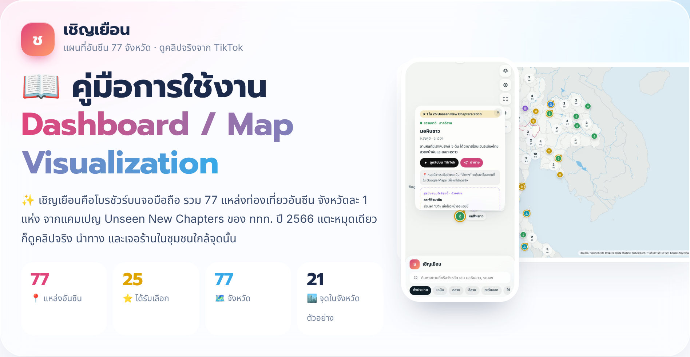
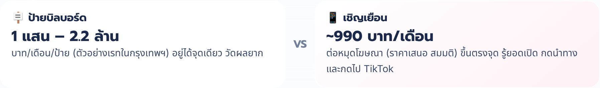
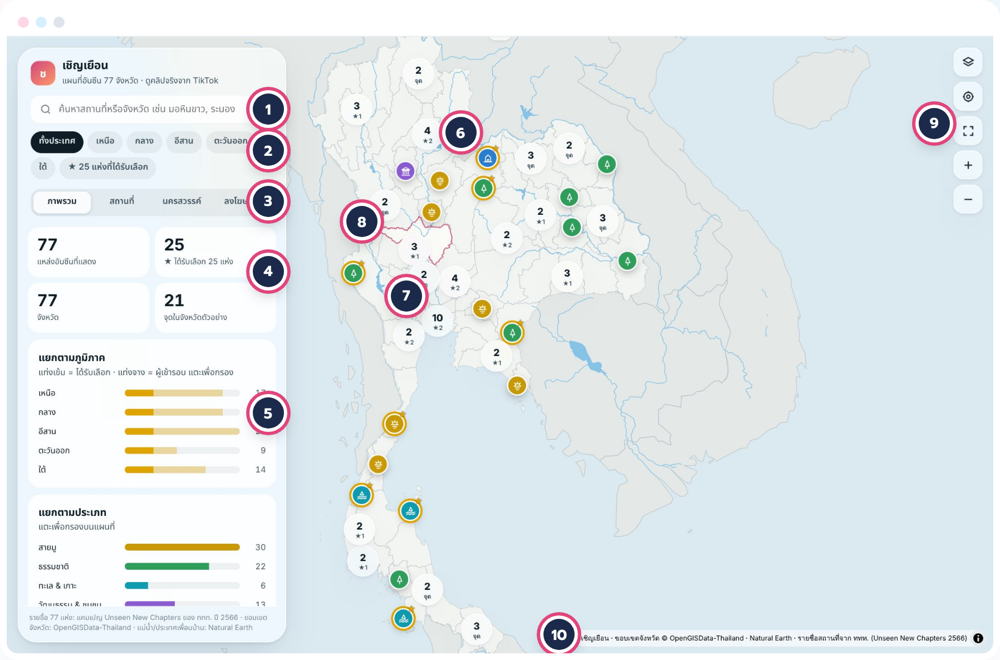
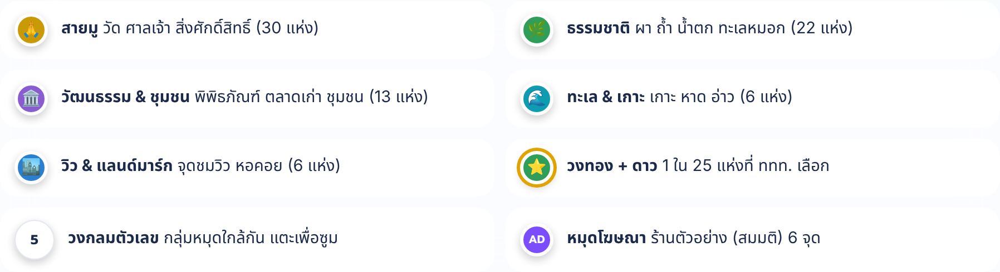
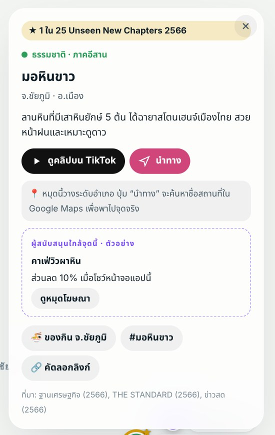
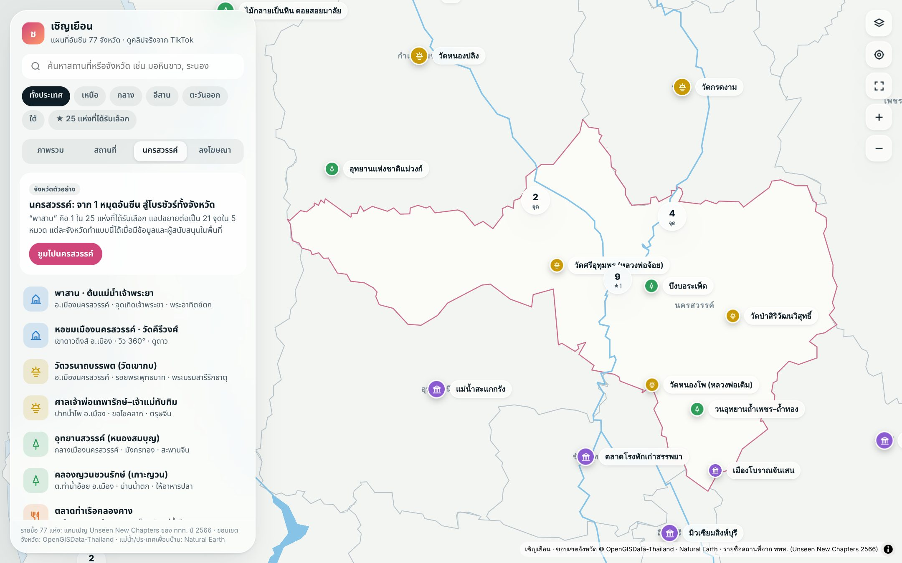
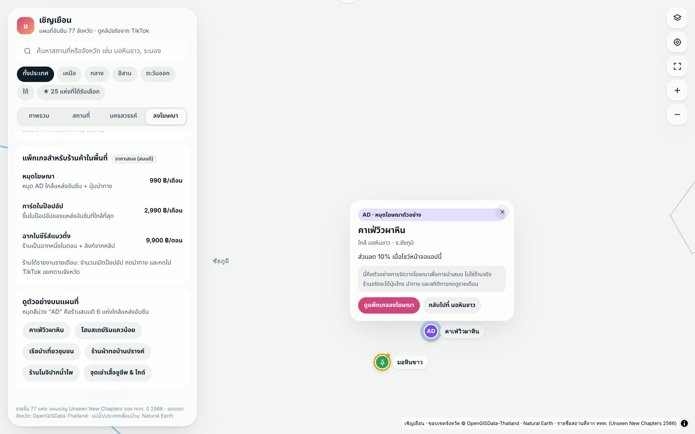
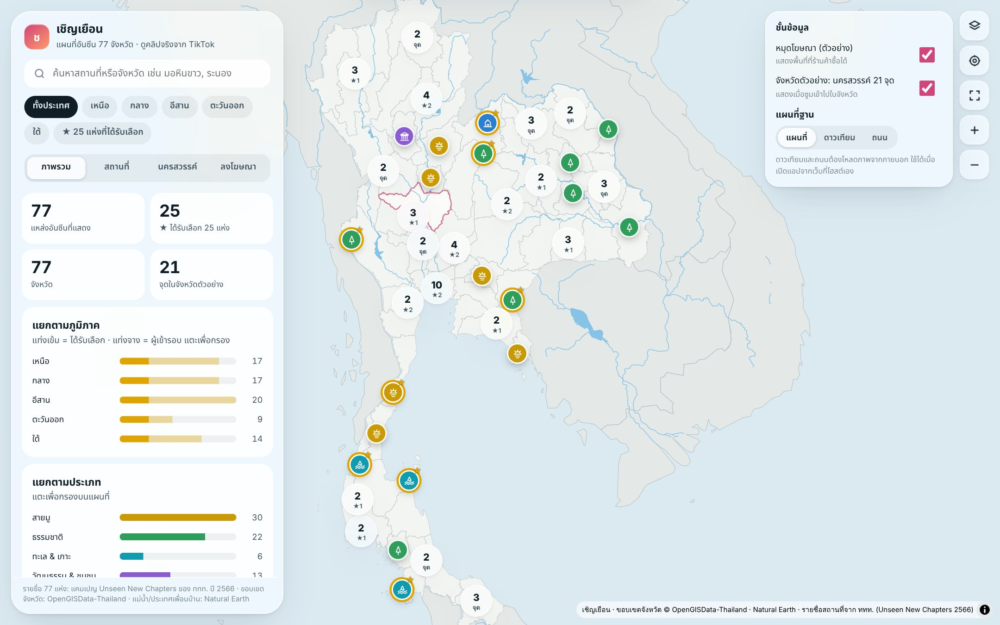
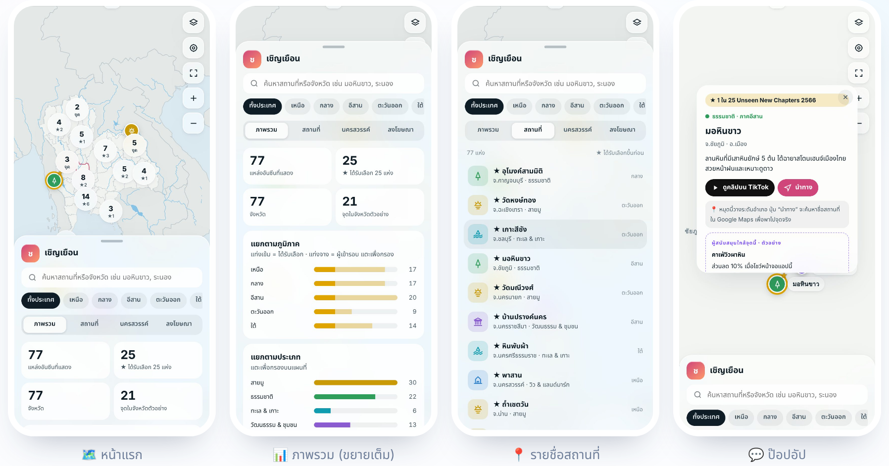
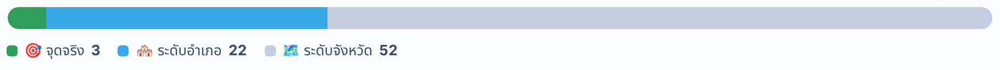

<p align="center">
  
</p>

<h1 align="center">🩷 เชิญเยือน · Chern Yuean</h1>

<p align="center">
  <b>โบรชัวร์บนจอมือถือ แผนที่ 77 แหล่งท่องเที่ยวอันซีนทั่วไทย ดูคลิปจริงจาก TikTok</b><br>
  <sub>Dashboard / Map Visualization · Lab 5 AI for Business Planning · หัวข้อ AI เพื่อการท่องเที่ยวอย่างยั่งยืน</sub>
</p>

<p align="center">
  
  
  
  
</p>

<p align="center">
  🌐 <a href="index.html"><b>เปิดแอป</b></a> &nbsp;·&nbsp;
  📖 <a href="guide/index.html"><b>คู่มือแบบหน้าเว็บ</b></a> &nbsp;·&nbsp;
  📄 <a href="docs/Chern_Yuean_User_Guide.pdf"><b>คู่มือ PDF</b></a>
</p>

> [!TIP]
> เมื่อเปิด GitHub Pages แล้ว (ดูหัวข้อ [🚀 ขึ้นเว็บอัตโนมัติ](#deploy)) แอปจะอยู่ที่ [https://gottalomlok.github.io/GE439-Artificial-Intelligence-AI-For-Social-Good-1-/Lab5/](https://gottalomlok.github.io/GE439-Artificial-Intelligence-AI-For-Social-Good-1-/Lab5/) และคู่มือที่ [https://gottalomlok.github.io/GE439-Artificial-Intelligence-AI-For-Social-Good-1-/Lab5/guide/](https://gottalomlok.github.io/GE439-Artificial-Intelligence-AI-For-Social-Good-1-/Lab5/guide/)

---

## 📑 สารบัญ

| | | |
|:--|:--|:--|
| 💡 [ทำไมต้องเป็นโบรชัวร์บนจอมือถือ](#why) | 🚀 [เริ่มใช้งานใน 3 ขั้น](#start) | 🗺️ [รู้จักหน้าจอ Dashboard](#screen) |
| 🎨 [ความหมายของสีหมุด](#pins) | 💬 [ป๊อปอัปของแต่ละสถานที่](#popup) | 📊 [แท็บทั้ง 4](#tabs) |
| 🧩 [ชั้นข้อมูลและแผนที่ฐาน](#layers) | 📱 [ใช้บนมือถือ](#mobile) | 🔗 [แชร์ลิงก์หมุดไป TikTok](#share) |
| 🌐 [วิธีเปิดแอป 3 แบบ](#open) | 📐 [ข้อมูลและความแม่นยำ](#data) | 🛠️ [แก้ปัญหาที่พบบ่อย](#fix) |

---

<a id="why"></a>

## 💡 ทำไมต้องเป็น “โบรชัวร์บนจอมือถือ”

ป้ายบิลบอร์ดอยู่ได้จุดเดียวและแพง ส่วน **เชิญเยือน** อยู่ในมือนักท่องเที่ยวทุกคนที่กดลิงก์จาก TikTok โฆษณาของร้านในชุมชนจึงขึ้นตรงหน้าสถานที่ที่เขากำลังสนใจ และนับยอดกดได้ทุกครั้ง

<p align="center"></p>

<sub>ที่มา: เรทบิลบอร์ดจาก Thumbsup (2562) · โฆษณา TikTok ในไทย CPM US$0.90–2.60 จาก Stackmatix (2026) · ราคาหมุดโฆษณาเป็นราคาเสนอ (สมมติ)</sub>

---

<a id="start"></a>

## 🚀 เริ่มใช้งานใน 3 ขั้น

1. 🌐 **เปิดแอป** — เปิดลิงก์เว็บ หรือดับเบิลคลิก `index.html` แผนที่ประเทศไทยพร้อมหมุด 77 แห่งจะขึ้นทันที
2. 🔎 **เลือกสิ่งที่สนใจ** — กดชิปภาค เช่น **อีสาน** หรือ **⭐ 25 แห่ง** พิมพ์ค้นหาชื่อจังหวัด หรือแตะแท่งกราฟประเภท เช่น **สายมู**
3. 👆 **แตะหมุด** — กด **▶ ดูคลิปบน TikTok** เพื่อดูบรรยากาศจริง แล้วกด **🧭 นำทาง** เพื่อไปเลย

---

<a id="screen"></a>

## 🗺️ รู้จักหน้าจอ Dashboard

หน้าจอแบ่งเป็นแผงควบคุมกระจกใสด้านซ้าย แผนที่ตรงกลาง และปุ่มควบคุมด้านขวาบน ตัวเลขบนภาพตรงกับตารางด้านล่าง

<p align="center"></p>

| # | ส่วน | ทำอะไร |
|:-:|:--|:--|
| 1 | 🔎 **ช่องค้นหา** | พิมพ์ชื่อสถานที่ จังหวัด หรืออำเภอ ถ้าไม่เจอจะมีปุ่มค้นคำนั้นบน TikTok ให้ |
| 2 | 🧭 **ชิปภูมิภาค + ⭐ 25 แห่ง** | กรองตามภาค หรือดูเฉพาะแหล่งที่ ททท. เลือก |
| 3 | 🗂️ **แท็บ 4 แท็บ** | ภาพรวม · สถานที่ · นครสวรรค์ · ลงโฆษณา |
| 4 | 🔢 **ตัวเลขสรุป** | จำนวนแหล่งที่แสดง ที่ได้รับเลือก จังหวัด และจุดในจังหวัดตัวอย่าง เปลี่ยนตามตัวกรอง |
| 5 | 📊 **กราฟแท่ง** | แยกตามภาค ประเภท และความแม่นยำของหมุด แตะแท่งเพื่อกรองบนแผนที่ |
| 6 | ⭐ **หมุดวงทอง** | 1 ใน 25 แห่งที่ได้รับเลือก สีด้านในบอกประเภท |
| 7 | 🔵 **วงกลมตัวเลข** | หมุดหลายจุดที่อยู่ใกล้กัน แตะเพื่อซูมเข้า ★ บอกจำนวนแหล่งที่ได้รับเลือกในกลุ่ม |
| 8 | 🩷 **เส้นขอบชมพู** | นครสวรรค์ จังหวัดตัวอย่างที่ซูมเข้าไปแล้วเห็นอีก 21 จุด |
| 9 | 🎛️ **ปุ่มควบคุม** | ชั้นข้อมูล · ตำแหน่งของฉัน · ดูทั้งประเทศ · ซูม + / − |
| 10 | 📝 **แหล่งที่มา** | เครดิตแผนที่และข้อมูล แตะ ⓘ เพื่อดูเต็ม |

---

<a id="pins"></a>

## 🎨 ความหมายของสีหมุด

ดูสีก็รู้ประเภทก่อนแตะ หมุดที่มีวงทองและดาวคือแหล่งที่ได้รับเลือก

<p align="center"></p>

| หมุด | ประเภท | จำนวน |
|:--|:--|--:|
| 🟡 ทอง | 🙏 **สายมู** วัด ศาลเจ้า สิ่งศักดิ์สิทธิ์ | 30 |
| 🟢 เขียว | 🌿 **ธรรมชาติ** ผา ถ้ำ น้ำตก ทะเลหมอก | 22 |
| 🟣 ม่วง | 🏛️ **วัฒนธรรม & ชุมชน** พิพิธภัณฑ์ ตลาดเก่า ชุมชน | 13 |
| 🩵 ฟ้าอมเขียว | 🌊 **ทะเล & เกาะ** เกาะ หาด อ่าว | 6 |
| 🔵 น้ำเงิน | 🏙️ **วิว & แลนด์มาร์ก** จุดชมวิว หอคอย | 6 |
| ⭐ วงทอง + ดาว | 1 ใน 25 แห่งที่ ททท. เลือก | 25 |
| ⚪ วงกลมตัวเลข | กลุ่มหมุดใกล้กัน แตะเพื่อซูม | – |
| 💜 AD | หมุดโฆษณา ร้านตัวอย่าง (สมมติ) | 6 |

---

<a id="popup"></a>

## 💬 ป๊อปอัปของแต่ละสถานที่

<table>
<tr>
<td width="42%" align="center"><br><sub>ป๊อปอัป “มอหินขาว” 1 ใน 25 แห่งที่ได้รับเลือก</sub></td>
<td>

แตะหมุดแล้วป๊อปอัปกระจกใสจะเด้งขึ้นเหนือหมุด ทุกปุ่มเปิดในแท็บใหม่

- ⭐ **ป้ายบนสุด** บอกว่าเป็น 1 ใน 25 แห่ง หรือผู้เข้ารอบตัวแทนจังหวัด
- ▶️ **ดูคลิปบน TikTok** เปิดผลค้นหาคลิปจริงของที่นี่
- 🧭 **นำทาง** เปิด Google Maps พาไปจุดจริง
- 📍 **กล่องเทา** บอกว่าหมุดแม่นระดับไหน
- 💜 **กล่องเส้นประม่วง** ผู้สนับสนุนใกล้จุดนี้ (ตัวอย่าง) หรือ “พื้นที่โฆษณาว่าง”
- 🍜 **ของกิน จ.…** ค้นคลิปของกินของจังหวัดนั้น
- #️⃣ **แฮชแท็ก** เปิดหน้าแฮชแท็กบน TikTok
- 🔗 **คัดลอกลิงก์** ลิงก์ที่เปิดหมุดนี้ทันที

</td>
</tr>
</table>

---

<a id="tabs"></a>

## 📊 แท็บทั้ง 4

| แท็บ | เห็นอะไร | ทำอะไรได้ |
|:--|:--|:--|
| 📊 **ภาพรวม** | ตัวเลขสรุป 4 ช่อง กราฟแท่งตามภาค (แท่งเข้ม = ได้รับเลือก แท่งจาง = ผู้เข้ารอบ) ตามประเภท และความแม่นยำของหมุด | แตะกราฟเพื่อกรอง กดปุ่มดูคลิป Unseen บน TikTok |
| 📍 **สถานที่** | รายชื่อแหล่งอันซีน ⭐ ขึ้นก่อน | แตะชื่อแล้วแผนที่บินไปที่หมุด ถ้าเปิดตำแหน่งของฉัน จะเรียงจากใกล้ไปไกล |
| 🏙️ **นครสวรรค์** | จังหวัดตัวอย่าง 21 จุดใน 5 หมวด เช่น พาสาน หอชมเมือง บึงบอระเพ็ด ตลาดชุมแสง | กด “ซูมไปนครสวรรค์” เพื่อดูโบรชัวร์ระดับจังหวัด |
| 💸 **ลงโฆษณา** | เทียบบิลบอร์ดกับ TikTok แพ็กเกจราคาเสนอ 3 แบบ และร้านตัวอย่าง 6 ร้าน | แตะชื่อร้านเพื่อดูหมุด AD บนแผนที่ |

<table>
<tr>
<td align="center" width="50%"><br><sub>🏙️ แท็บนครสวรรค์: จาก 1 หมุดอันซีนเป็น 21 จุด</sub></td>
<td align="center" width="50%"><br><sub>💸 แท็บลงโฆษณาและหมุด AD ตัวอย่าง</sub></td>
</tr>
</table>

> [!NOTE]
> แพ็กเกจในแท็บลงโฆษณา (หมุด AD 990 · การ์ดในป๊อปอัป 2,990 · ฉากในซีรีส์ 9,900 บาท) เป็นราคาสมมติเพื่อการนำเสนอ

---

<a id="layers"></a>

## 🧩 ชั้นข้อมูลและแผนที่ฐาน

<table>
<tr>
<td width="50%" align="center"><br><sub>กดปุ่มรูปแผ่นซ้อน (บนสุดของแถวขวา)</sub></td>
<td>

- 📢 **หมุดโฆษณา (ตัวอย่าง)** — เปิดไว้ หมุด AD ขึ้นเมื่อซูมเข้าใกล้พอ
- 🏙️ **จังหวัดตัวอย่าง** — เปิดไว้ ซูมเข้านครสวรรค์แล้วเห็นอีก 21 จุด
- 🛰️ **แผนที่ / ดาวเทียม / ถนน** — แอปพยายามเปิด **ดาวเทียม** ให้เองตอนเริ่ม ถ้าโหลดไม่ได้จะใช้แผนที่ในตัวแอป ดาวเทียมใช้ Sentinel-2 cloudless (สำรองด้วย Esri) ส่วนถนนใช้ CARTO/OpenStreetMap

</td>
</tr>
</table>

> [!TIP]
> ภาพดาวเทียมและแผนที่ถนนโหลดจากเว็บภายนอก จึงเห็นได้เมื่อเปิดจาก GitHub Pages, Netlify หรือไฟล์ในเครื่อง

---

<a id="mobile"></a>

## 📱 ใช้บนมือถือ

บนมือถือ แผนที่อยู่ครึ่งบน แผงควบคุมกลายเป็นแผ่นเลื่อนจากด้านล่าง

<p align="center"></p>

| ☝️ แถบเทาด้านบน | 📍 แตะหมุด | 🔎 แตะช่องค้นหา |
|:--|:--|:--|
| แตะเพื่อสลับขนาดแผง เต็มจอ → ย่อ → ปกติ | แผงย่อลงเองให้เห็นป๊อปอัป แตะที่ว่างบนแผนที่เพื่อคืนขนาด | แผงขยายเต็มจอให้พิมพ์และเลือกผลได้ง่าย |

---

<a id="share"></a>

## 🔗 แชร์ลิงก์หมุดไป TikTok

ทุกหมุดมีลิงก์ของตัวเอง เอาไปวางในไบโอหรือคอมเมนต์ TikTok คนดูกดแล้วเข้าแอปพร้อมเปิดหมุดนั้นทันที

1. 👆 แตะหมุด แล้วกด **🔗 คัดลอกลิงก์** ในป๊อปอัป
2. 📋 วางในไบโอ คอมเมนต์ปักหมุด หรือแคปชันคลิป TikTok
3. ✨ คนดูกดลิงก์ แอปบินไปที่หมุดและเปิดป๊อปอัปให้เอง

```text
https://gottalomlok.github.io/GE439-Artificial-Intelligence-AI-For-Social-Good-1-/Lab5/#p-u16          → พาสาน
https://gottalomlok.github.io/GE439-Artificial-Intelligence-AI-For-Social-Good-1-/Lab5/#p-ns-boraphet  → บึงบอระเพ็ด (จังหวัดตัวอย่าง)
```

> [!NOTE]
> แอปไม่ได้เก็บหรือฝังคลิป TikTok ไว้ ทุกปุ่มแค่เปิดหน้าค้นหาหรือแฮชแท็กบน TikTok

---

<a id="open"></a>

## 🌐 วิธีเปิดแอป 3 แบบ

| วิธีเปิด | ทำอย่างไร | 🛰️ ดาวเทียม / ถนน | 📍 ตำแหน่งของฉัน | 👥 ใครเปิดได้ |
|:--|:--|:-:|:-:|:--|
| 🐙 **GitHub Pages** | push repo นี้ แล้วเปิด Pages ครั้งเดียว ([ดูด้านล่าง](#deploy)) | ✅ | ✅ | ทุกคนที่มีลิงก์ |
| ☁️ **Netlify** | ลาก `index.html` ไปวางที่ app.netlify.com/drop แล้วกด Claim this site ภายใน 1 ชั่วโมง | ✅ | ✅ | ทุกคนที่มีลิงก์ |
| 💻 **ไฟล์ในเครื่อง** | ดับเบิลคลิก `index.html` (ต้องต่อเน็ต) | 🟡 น่าจะได้ ยังไม่ได้ทดสอบ | 🟡 ขึ้นกับเบราว์เซอร์ | คนที่ได้ไฟล์ |

---

<a id="data"></a>

## 📐 ข้อมูลและความแม่นยำของหมุด

มี **3 จาก 77** หมุดที่วางตรงจุดจริง ที่เหลือเป็นจุดกลางอำเภอหรือจังหวัด ดูภาพรวมได้ แต่เวลาเดินทางให้กด **🧭 นำทาง** เสมอ เพราะปุ่มนี้ค้นชื่อจริงใน Google Maps

<p align="center"></p>

| ✅ มีอะไรบ้าง | ⚠️ ข้อจำกัด |
|:--|:--|
| รายชื่อ 77 แห่งครบทุกจังหวัด | อีก 52 แห่งมีแค่ชื่อและจังหวัด |
| คำบรรยายและอำเภอของ 25 แห่งที่ได้รับเลือก | ร้าน AD และราคาแพ็กเกจเป็นตัวอย่างสมมติ |
| จังหวัดตัวอย่างนครสวรรค์ 21 จุด พร้อมเวลาเปิดและค่าเข้า | ผลค้นหา TikTok อาจมีคลิปไม่ตรง |
| | ภาพดาวเทียม Sentinel-2 cloudless ใช้ฟรีเฉพาะงานไม่แสวงกำไร (CC BY-NC-SA 4.0) |

**📚 แหล่งข้อมูล:**
[ฐานเศรษฐกิจ (รายชื่อ 77 แห่ง)](https://www.thansettakij.com/business/tourism/565025) ·
[ข่าวสด (25 แห่ง + อำเภอ)](https://www.khaosod.co.th/lifestyle/travel/news_7737703) ·
[THE STANDARD (คำบรรยาย)](https://thestandard.co/life/25-unseen-new-chapters-thailand/) ·
[KTC (นครสวรรค์)](https://www.ktc.co.th/article/travel-guide/thailand/travel-in-nakhonsawan) ·
[OpenGISData-Thailand](https://github.com/chingchai/OpenGISData-Thailand) ·
[Natural Earth](https://www.naturalearthdata.com/) ·
[Sentinel-2 cloudless (EOX)](https://s2maps.eu) ·
[MapLibre GL JS](https://github.com/maplibre/maplibre-gl-js)

---

<a id="fix"></a>

## 🛠️ แก้ปัญหาที่พบบ่อย

| 😕 อาการ | 🔍 สาเหตุ | ✅ วิธีแก้ |
|:--|:--|:--|
| กด “ดาวเทียม” แล้วขึ้นว่าโหลดไม่ได้ | เปิดในหน้าที่ไม่ให้โหลดภาพจากเว็บอื่น (เช่น ลิงก์ claude.ai) | เปิดจาก GitHub Pages / Netlify หรือดับเบิลคลิกไฟล์ |
| ปุ่มตำแหน่งของฉันไม่ทำงาน | ยังไม่อนุญาตตำแหน่ง | เปิดผ่าน https แล้วกดอนุญาตตำแหน่งในเบราว์เซอร์ |
| GitHub Pages ขึ้น 404 | ยังไม่ได้ตั้ง Source เป็น GitHub Actions หรือ workflow ยังรันไม่เสร็จ | ดูขั้นตอนด้านล่าง แล้วรอแท็บ Actions ขึ้นเครื่องหมายถูก ✅ |
| แผนที่ไม่ขึ้นเลย | ไม่ได้ต่อเน็ต | ต่อเน็ตแล้วรีเฟรชหน้า |
| หาหมุดที่ต้องการไม่เจอ | ถูกรวมเป็นกลุ่ม หรือตัวกรองค้างอยู่ | แตะวงกลมตัวเลข หรือกด “ทั้งประเทศ” และปิดชิป ⭐ |
| ปุ่มคัดลอกลิงก์ไม่คัดลอก | เบราว์เซอร์ไม่ให้เข้าคลิปบอร์ด | แอปจะแสดงลิงก์ในแถบแจ้งเตือน ให้คัดลอกเอง |

---

<a id="deploy"></a>

## 🚀 ขึ้นเว็บอัตโนมัติด้วย GitHub Pages

โฟลเดอร์นี้อยู่ใน repo รวมงาน GE439 ที่ `Lab5/` ไฟล์ workflow อยู่ที่ราก repo (`.github/workflows/pages.yml`) และ deploy ทั้ง repo ทุกครั้งที่ push เข้า `main`

1. ⚙️ **Settings → Pages → Build and deployment → Source** เลือก **GitHub Actions** (ทำครั้งเดียว)
2. ⏳ เปิดแท็บ **Actions** รอ workflow “Deploy เชิญเยือน to GitHub Pages” ขึ้น ✅
3. 🎉 แอป: [https://gottalomlok.github.io/GE439-Artificial-Intelligence-AI-For-Social-Good-1-/Lab5/](https://gottalomlok.github.io/GE439-Artificial-Intelligence-AI-For-Social-Good-1-/Lab5/) · คู่มือ: [https://gottalomlok.github.io/GE439-Artificial-Intelligence-AI-For-Social-Good-1-/Lab5/guide/](https://gottalomlok.github.io/GE439-Artificial-Intelligence-AI-For-Social-Good-1-/Lab5/guide/)

```text
📁 GE439-Artificial-Intelligence-AI-For-Social-Good-1-/
├── .github/workflows/pages.yml   ← deploy อัตโนมัติ (อยู่ที่ราก repo)
├── .nojekyll
├── Lab1 … Lab4/
└── Lab5/
    ├── index.html                ← แอปเชิญเยือน
    ├── guide/                    ← คู่มือแบบหน้าเว็บ + รูป
    ├── docs/
    │   ├── Chern_Yuean_User_Guide.pdf
    │   └── img/                  ← รูปประกอบ README
    └── README.md
```

---

<p align="center">
  🩷 <b>เชิญเยือน</b> · คู่มือการใช้งานเวอร์ชัน 8 ต.ค. 2569<br>
  <sub>Lab 5 AI for Business Planning · ข้อมูลแผนที่ © OpenGISData-Thailand, Natural Earth, EOX, Esri, CARTO/OpenStreetMap · รายชื่อสถานที่จากแคมเปญ Unseen New Chapters ของ ททท. (2566)</sub>
</p>
